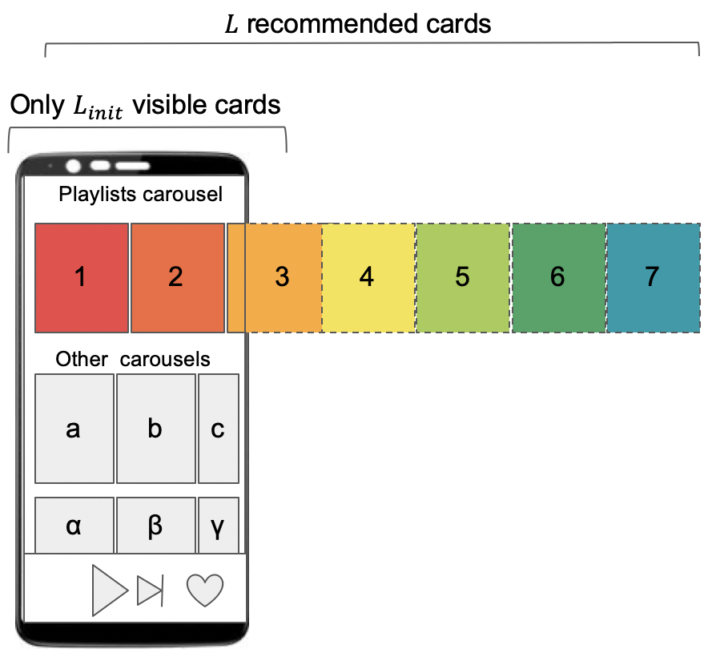
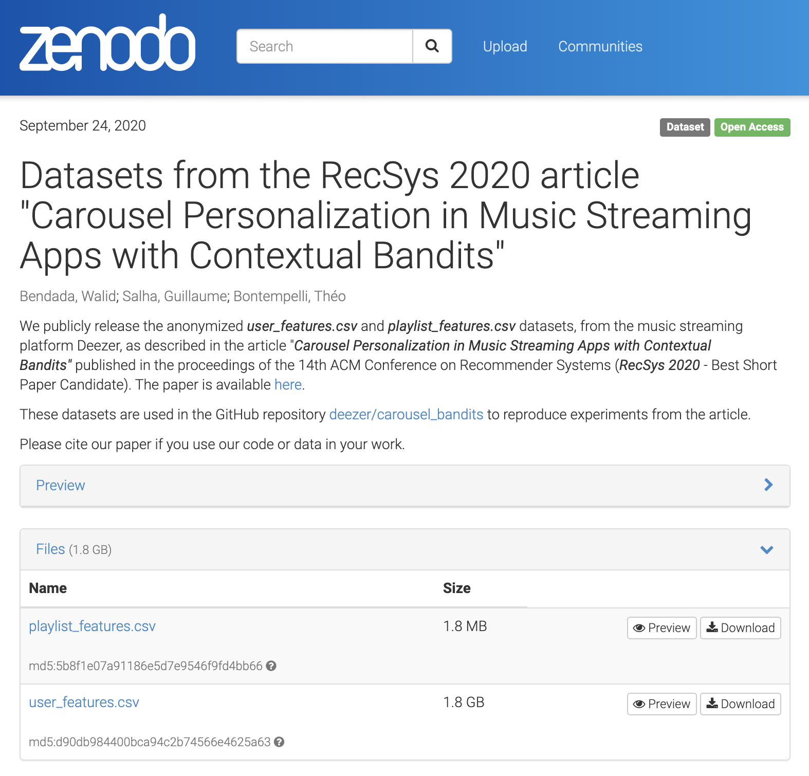
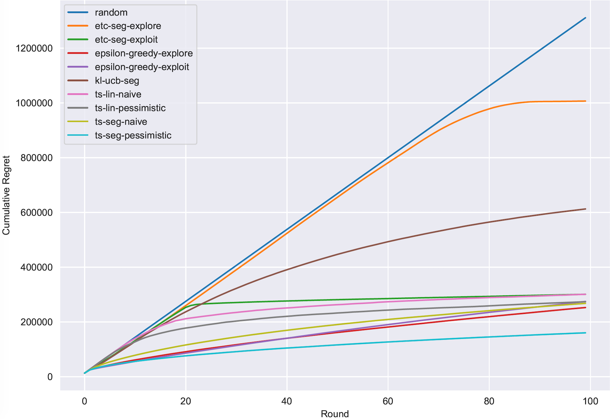
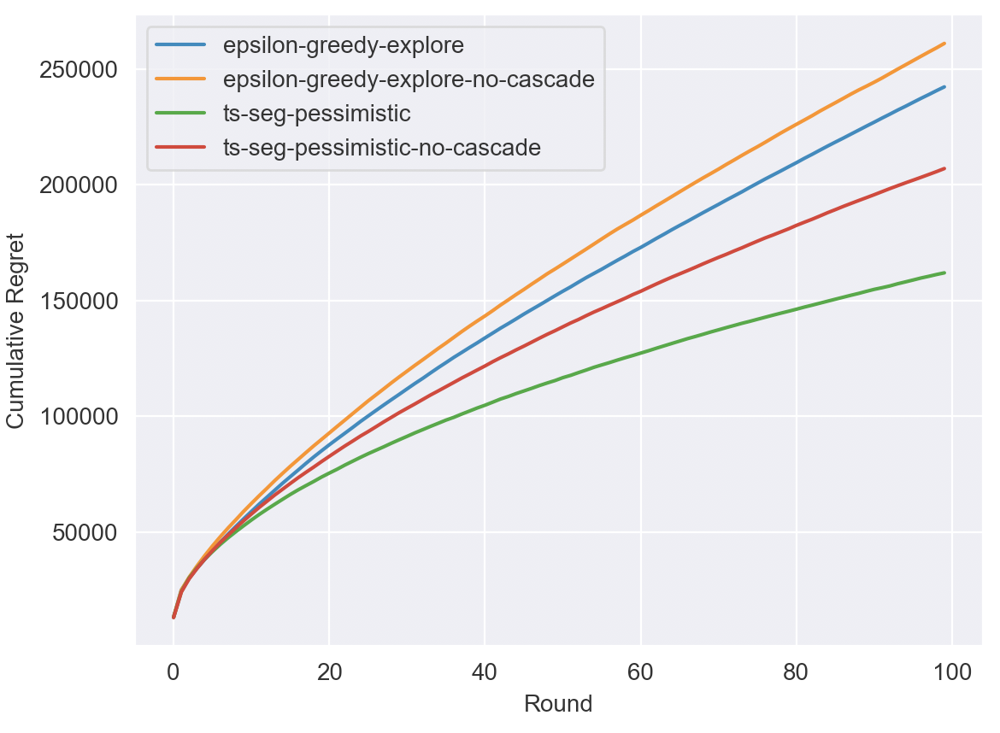

# Carousel Personalization in Music Streaming Apps with Contextual Bandits - RecSys 2020

This repository provides Python code and data to reproduce experiments from the article [Carousel Personalization in Music Streaming Apps with Contextual Bandits](https://arxiv.org/abs/2009.06546.pdf) published in the proceedings of the 14th ACM Conference on Recommender Systems ([RecSys 2020](https://recsys.acm.org/recsys20/) - _Best Short Paper Candidate_).

## Carousel Personalization

Media services providers, such as the music streaming platform [Deezer](https://www.deezer.com/), often leverage **swipeable carousels** to recommend personalized content to their users. These carousels are ranked lists of _L_ items or **cards** from a substantially larger catalog (of size _K_), e.g. _L_ albums, artists or playlists recommended on the homepage of the Deezer app. Only a few cards, say _L_init_ < _L_, are initially displayed to users, who can **swipe** the screen to see additional cards.

Selecting the most relevant content to display in carousels is a challenging task, as the catalog is large and as users have different preferences. Also, ranking matters: some cards might not be seen by some users due to the swipeable structure.

<p align="center">
  
</p>

In [Section 2 of our RecSys paper](https://arxiv.org/pdf/2009.06546.pdf), we model carousel personalization as a **multi-armed bandit** problem with **multiple plays**, **cascade**-based updates, **delayed batch feedback** and **contextual information** on users. We aim at capturing the most important characteristics of real-world swipeable carousels.

Then, we evaluate our framework by addressing a **carousel-based playlist recommendation task** on Deezer. We selected **K = 862 playlists**, that were created by professional curators from Deezer with the purpose of complying with a specific music genre, cultural area or mood, and that are among the most popular ones on the service. Playlists' cover images constitute the cards that can be recommended to users on the app homepage in a carousel, updated on a daily basis, with **L = 12** available slots and **L_init = 3** cards initially displayed. We aim at maximizing **display-to-stream rates** i.e. at identifying the _L_ cards on which each user is the most likely to _click_ and then to _stream_ the underlying content, _at least once_ during the round (= binary **reward** of 1 for each streamed playlist).

To determine which method (among the several bandit-based strategies mentioned in the paper - _see table below_) would best succeed in making users stream the recommended playlists, extensive experiments were conducted in two steps:
- First, **offline experiments** simulating the responses of **974 960 users** (anonymized) to carousel-based recommendations were run, on a simulation environment and on data that we both publicly release in this repository.
- In the paper, these experiments were completed by an **online A/B test** on the Deezer app.


## Installation

### Code

```Bash
git clone https://github.com/deezer/carousel_bandits
cd carousel_bandits
```

Requirements: python 3, matplotlib, numpy, pandas, scipy, seaborn

### Data

We release two datasets, detailed in Section 3.2 of the paper:
- `user_features.csv`:  a dataset of 974 960 fully anonymized Deezer users. Each user is described by:
    - a 96-dimensional embedding vector (fields `dim_0` to `dim_95`), to which we subsequently add a _bias_ term in our code, summarizing the user's musical preferences (_see paper for details on computations of embedding vectors_)
    - a `segment`: a _k_-means clustering with _k = 100_ clusters was performed internally, to also assign a segment to each user, as required by policies implementing our proposed _semi-personalization_ strategy
- `playlist_features.csv`: a dataset of 862 playlists. Each playlist _i_ is described by:
    - a 97-dimensional weight vector, corresponding to the _theta_i_ vectors from Section 3.2 of the paper (_see paper for details on computations of weight vectors_). For each user-playlist pair _(u,i)_, the released "ground-truth" display-to-stream probability is as follows, where the 97-dimensional _x_u_ vector corresponds to the concatenation of the 96-dim embedding vector of user _u_ and of the bias term, and where _sigma_ denotes the sigmoid activation function:

<p align="center">
  
</p>

#### Download complete datasets

Due to size restrictions, this repository only provides the `playlist_features.csv` dataset and a *very small* version of the user dataset with 9 users, named `user_features_small.csv`, in the `data` folder.

The complete `user_features.csv` dataset with 974 960 users is [available for download on Zenodo](https://zenodo.org/record/4048678#.X22w4pMza3J).

Please download it there and subsequently place it in the `data` folder.

<p align="center">
  
</p>


## Run Offline Experiments

Simulations proceed as detailed in [Section 3.2 of the paper](https://arxiv.org/pdf/2009.06546.pdf).

Type in the following commands to run offline experiments with similar hyperparameters w.r.t. the paper.

### General Experiments (Figure 2 of RecSys paper)

Offline evaluation of Top-12 playlist recommendation: expected cumulative regrets of policies over 100 simulated rounds.

#### Evaluation of all policies on `user_features_small.csv` (useful for quick testing)
```Bash
python main.py --users_path data/user_features_small.csv --policies random,etc-seg-explore,etc-seg-exploit,epsilon-greedy-explore,epsilon-greedy-exploit,kl-ucb-seg,ts-seg-naive,ts-seg-pessimistic,ts-lin-naive,ts-lin-pessimistic --n_users_per_round 9 --output_path general_experiment_results.json
python plot_results.py --data_path general_experiment_results.json
```

#### Evaluation of random and ts-seg-pessimistic policies on the complete `user_features.csv`
```Bash
python main.py --policies random,ts-seg-pessimistic --print_every 5 --output_path general_experiment_results.json
python plot_results.py --data_path general_experiment_results.json
```

#### Evaluation of all policies on the complete `user_features.csv` (takes some time!)
```Bash
python main.py --policies random,etc-seg-explore,etc-seg-exploit,epsilon-greedy-explore,epsilon-greedy-exploit,kl-ucb-seg,ts-seg-naive,ts-seg-pessimistic,ts-lin-naive,ts-lin-pessimistic --print_every 1 --output_path general_experiment_results.json
python plot_results.py --data_path general_experiment_results.json
```

Results should look like:

<p align="center">
  
</p>

_Important note on `ts-lin` policies: our implementation of naive and pessimistic linear Thompson Sampling strategies have been improved since the publication of the RecSys paper. As a consequence, regret curves from these two policies are a bit different than in Figure 2 of the paper (results are better). Nonetheless, all conclusions from the article remain valid, especially regarding the comparison with ts-seg-pessimistic, and the comparison among ts-lin-naive and ts-lin-pessimistic._

### Cascade vs No-Cascade Experiments (Figure 3 of RecSys paper)

Comparison of cascade vs no-cascade policies for epsilon-greedy and ts-seg-pessimistic policies, over 100 simulated rounds.

We provide comments on our implementation of a **cascade-based behaviour** for these experiments in `policies.py`.

```Bash
python main.py --policies epsilon-greedy-explore,epsilon-greedy-explore-no-cascade,ts-seg-pessimistic,ts-seg-pessimistic-no-cascade --print_every 5 --output_path cascade_experiment_results.json
python plot_results.py --data_path cascade_experiment_results.json
```

Results should look like:

<p align="center">
  
</p>


### Complete list of `main.py` parameters


| Parameter        | Type           | Description  | Default Value |
| :-------------: |:-------------:| :-------------------------------|:-------------: |
| `users_path` | string | Path to user features file | `data/user_features.csv` |
| `playlists_path` | string | Path to playlist features file | `data/playlist_features.csv` |
| `output_path` | string | Path to a _json_ file to save regret values of each policy accross time | `results.json` |
| `policies` | string | List of bandit policies to evaluate, _separated by commas_, among: <br> - `random` <br> - `etc-seg-explore` <br> - `etc-seg-exploit` <br> - `epsilon-greedy-explore` <br> - `epsilon-greedy-exploit` <br> - `kl-ucb-seg` <br> - `ts-seg-naive` <br> - `ts-seg-pessimistic` <br> - `ts-lin-naive` <br> - `ts-lin-pessimistic` <br> - `epsilon-greedy-explore-no-cascade` <br> - `ts-seg_pessimistic-no-cascade` <br> Please see [Section 3 of the RecSys paper](https://arxiv.org/pdf/2009.06546.pdf) for details on policies. New policies must be implemented in `policies.py` and then defined in the `set_policies` function from `main.py`.  | `random,ts-seg-naive` |
| `n_recos` | int | Number of slots _L_ in the carousel i.e. number of recommendations that each policy must provide to users at each round | `12` |
| `l_init` | int | Number of slots _L_init_ initially visible in the carousel| `3` |
| `n_users_per_round` | int | Number of users drawn on the random subsets of users selected at each round. <br> Note: users are drawn _with replacement_, implying that some users might click on several playlists during a same round (multi-armed bandit with _multiple plays_ setting)| `20 000` |
| `n_rounds` | int | Number of simulated rounds | `100` |
| `print_every` | int | Print cumulative regrets of all policies every `print_every` round | `10`


## Cite

Please cite our paper if you use this code or data in your own work:

```BibTeX
@inproceedings{bendada2020carousel,
  title={Carousel Personalization in Music Streaming Apps with Contextual Bandits},
  author={Bendada, Walid and Salha, Guillaume and Bontempelli, Theo},
  booktitle={14th ACM Conference on Recommender Systems (RecSys 2020)},
  year={2020}
}
```
